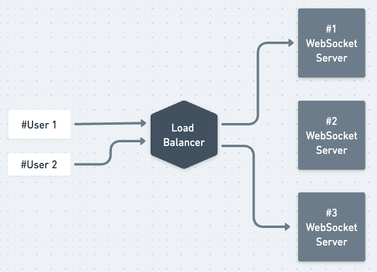
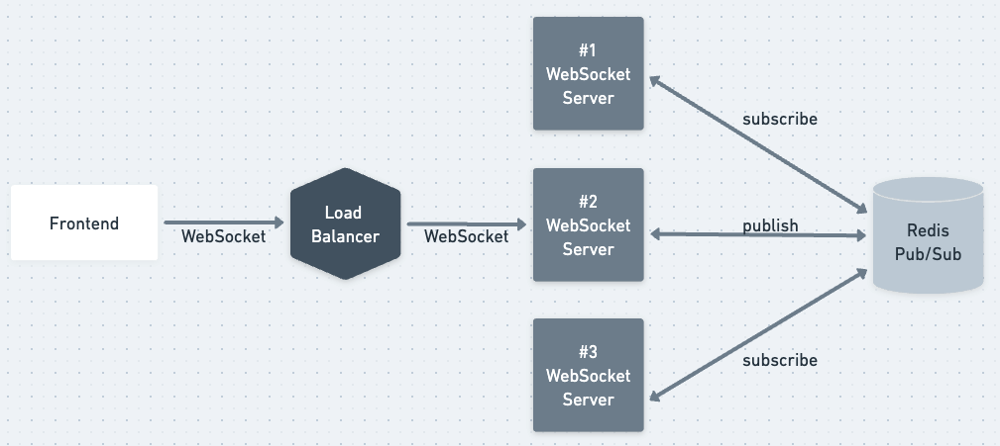
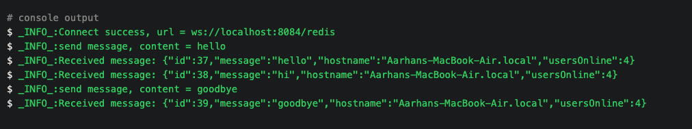
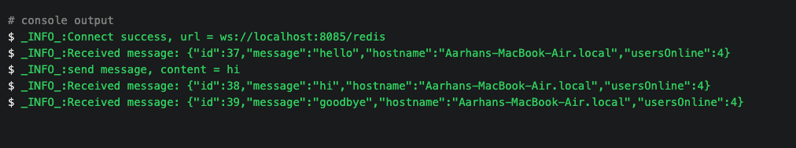

## Scalable Chat Server
  

A robust and horizontal scalable real-time chat server using SpringBoot WebFlux and Websocket-Redis(Pub/Sub). 
This demonstrates a real-time chat server in a Microservice Architecture to handle high demands,
while maintaining Sync between multiple instances.

### Horizontal Scaling 

Horizontal scaling refers to adding more machines to your infrastructure to cope with the high demand on the server. 
In our microservice context, scaling horizontally is the same as deploying more instances of the microservice,
A load balancer will then be required to distribute the traffic among the multiple microservice instances

### Issue : Message loss due to the load balancer / No Sync between instances

### Solution : Broadcast messages using Pub/Sub

This solution is inspired by Amr Saleh article - 
[Building Scalable Facebook-like Notification using Server-Sent Events and Redis](https://medium.com/javarevisited/building-scalable-facebook-like-notification-using-server-sent-event-and-redis-9d0944dee618)

### Examples

